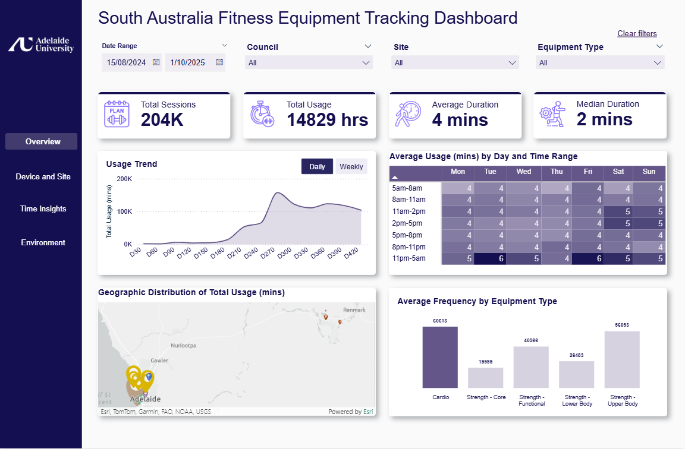
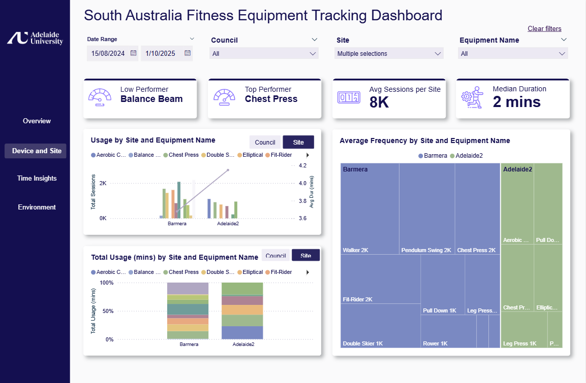
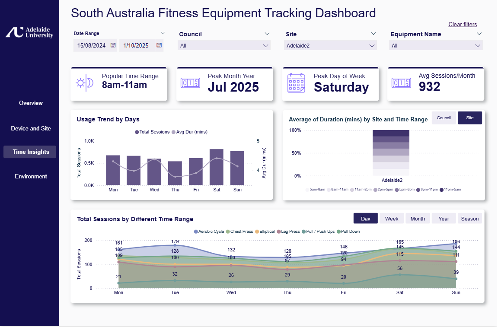
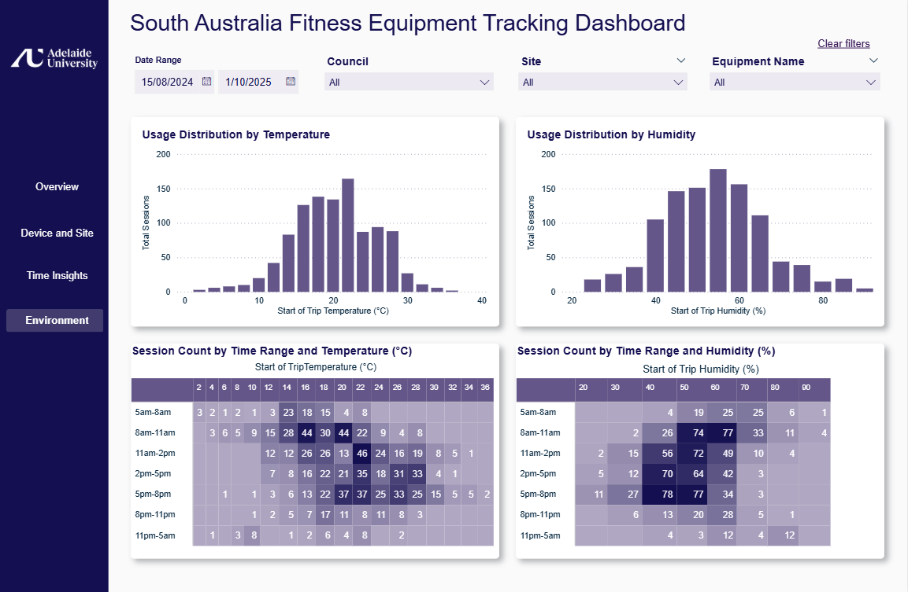

# Outdoor Fitness Equipment Usage Dashboard

**Confidentiality Notice**  
Due to confidentiality, only authorised individuals can access the OneDrive link to view the dashboard and its related documentation.  
Access link (authorised users only): [View Dashboard and Files](https://mymailunisaedu-my.sharepoint.com/:f:/g/personal/ochoapjj_unisa_edu_au/Eo6rb_gIFIRAsabmvlYUqecBttYlzFn-MMbwXrTiMzCCDQ?e=ZeKM3h)

This repository provides an overview of the Power BI dashboard developed to analyse outdoor fitness equipment usage across several South Australian councils. The dashboard supports evidence-based decisions that promote physical activity, asset management, and community wellbeing.

---

## Overview Page

The Overview page provides a summary of key usage metrics across councils.  
It includes total sessions, average duration, and overall activity distribution, allowing users to quickly identify highly active areas and general participation levels.

---

## Device and Site Page

This page presents detailed insights into equipment and site-level performance.  
Users can compare session frequency and duration across locations to identify underused assets and prioritise maintenance, planning, and future investments.

---

## Time Insights Page

The Time Insights page visualises how usage varies across different times of the day, days of the week, and seasons.  
It supports analysis of peak activity periods to assist councils in optimising resource allocation and planning community programs.

---

## Environment Page

This page explores how environmental factors, such as temperature and humidity, influence outdoor exercise behaviour.  
It helps identify the relationship between weather conditions and usage patterns, supporting the design of climate-resilient recreational infrastructure.

---
